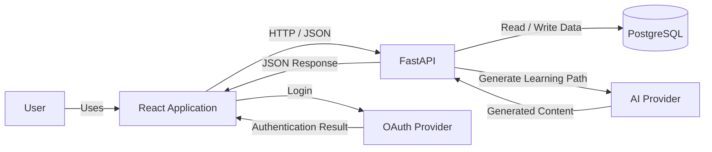

## Application Architecture and Data Flow

The application uses a simple client-server architecture.

### Architecture

The **React application** is the user interface. Users interact with React to sign in, generate learning paths, view their learning paths, and update their progress.

The **FastAPI backend** provides the application API. React communicates with FastAPI using HTTP requests and JSON responses. FastAPI contains the main backend logic and connects the frontend with the application's external services and data.

**PostgreSQL** stores persistent application data, such as users, learning paths, and progress.

The **OAuth provider** handles user authentication. React starts the login process and receives the authentication result.

The **AI provider** is used to generate learning paths. FastAPI sends the required information to the AI provider and returns the generated result to React.

### Main Data Flow

The main application flow is:

**User → React → FastAPI → PostgreSQL / AI Provider → FastAPI → React**

React does not communicate directly with PostgreSQL or the AI provider. These operations are handled by FastAPI.
